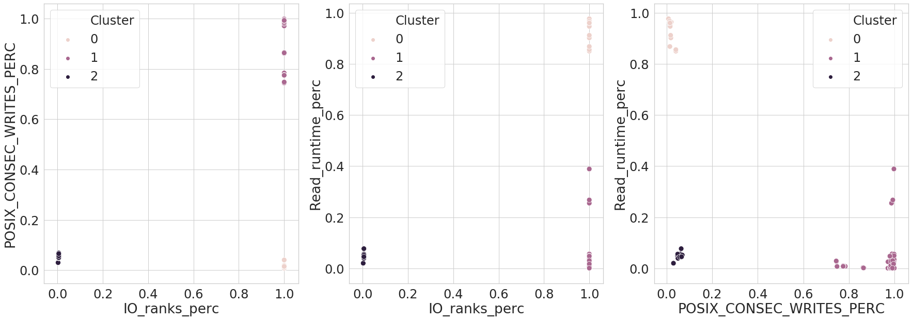
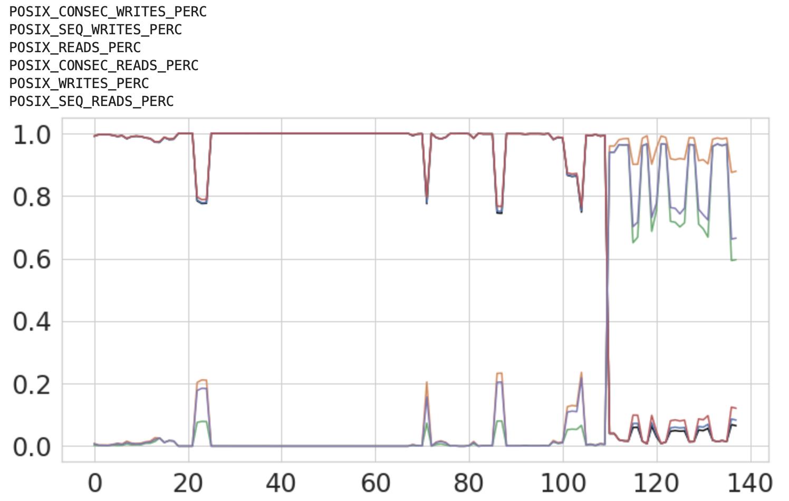

# Dirac
Program for Atomic and Molecular Direct Iterative Relativistic All-electron Calculations. Code can be found at: [http://www.diracprogram.org/doku.php](http://www.diracprogram.org/doku.php)

Total filtered entries for 2020: 656 out of 803, 81.69% have IO time less than 60 seconds.

Three types of application runs, separated by the main featuers (in the order of importance):
- `IO_ranks_perc`
- `POSIX_CONSEC_WRITES_PERC`
- `Read_runtime_perc`
- `Total_read_ranks_perc`
- `POSIX_SIZE_WRITE_1K_10K_PERC`
- `POSIX_SIZE_WRITE_10K_100K_PERC`

The following figure shows the properties of the 3 clusters in regards to the 6 features.


Visualizing individual features for the 3 clusters.


Correlated features:
```
{'IO_ranks_perc': set(),
 'Total_read_ranks_perc': {'POSIX_read_ranks_perc',
  'POSIX_write_ranks_perc',
  'Total_write_ranks_perc'},
 'POSIX_CONSEC_WRITES_PERC': {'POSIX_CONSEC_READS_PERC',
  'POSIX_READS_PERC',
  'POSIX_SEQ_READS_PERC',
  'POSIX_SEQ_WRITES_PERC',
  'POSIX_WRITES_PERC'},
 'Read_runtime_perc': {'POSIX_read_runtime_perc'},
 'POSIX_SIZE_WRITE_1K_10K_PERC': set(),
 'POSIX_SIZE_WRITE_10K_100K_PERC': set()}
```

Example of correlated features that have been compressed into one

