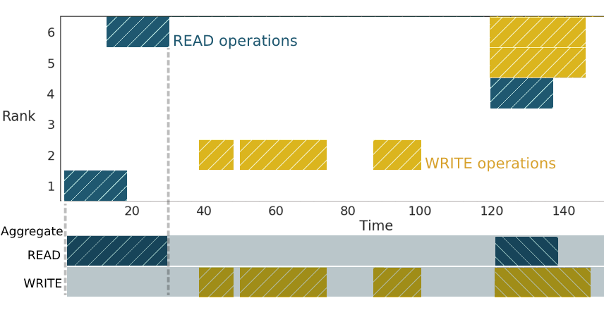

# Features description

A list of all features and a short description for each can be found in `features.desc.csv`.

The features from this file whose name is written in capital letters are defined by the Darshan log and are explained in the header of any Darshan log.
The rest are explained here.


Based on the figure above:
```c
Total_nprocs      = number of blue boxes              // Total number of processing units
Total_nprocs_perc = blue_boxes / total_boxes.         // Ratio of total number of processing units	to total cores in the system
IO_nprocs         = number of orange outlined boxes   // Number of ranks doing any IO
IO_nprocs_perc	  = orange_outline_boxes / blue_boxes // Ratio of the total ranks doing any IO to total application ranks
```

 

Using the top part of the figure above (not the aggregated one):
```c
// Total time time spent doing Read and Write to total execution time
IO_runtime = sum(width blue_regions) + sum(width orange_regions) / (total_application time * nprocs)

// Ratio of ranks doing READ/WRITE operations to total number of ranks doing IO
Perc_ranks_READS  = (number of lines that have a blue_region) / (number of lines that do any type of IO)
Perc_ranks_WRITES = (number of lines that have an orange_region) / (number of lines that do any type of IO)

// Ratio of ranks doing only READ/only WRITE/both READ and WRITE to total ranks doing IO
Ranks_read_write = (lines having both orange and blue regions) / (lines that do any type of IO)
Ranks_read_only  = (lines having only blue regions) / (lines that do any type of IO)
Ranks_write_only = (lines having only orange regions) / (lines that do any type of IO)

// Ratio of accesses overlaping other READS or WRITES to total number of accesses
Perc_overlap_access = Ratio of blue or orange regions that overlap with other blue or orange regions / sum(orange and blue regions) // 4/8 in the figure
READ_perc_overlap   = Ratio of blue regions that overlap with other blue or orange regions / sum(blue regions)                      // 3/8 in the figure 
WRITE_perc_overlap  = Ratio of orange regions that overlap with other orange regions / sum(orange regions)                          // 1/8 in the figure
```

Using the bottom part of the figure above (aggregated information for all ranks):
```c
// Total number of READ/WRITE operations that follow a previous READ/WRITE operation
// Time gap between operations is not taken into consideration
READ_after_READ   = (number of blue regions that are not separated by orange regions) / (total number of blue regions)  // 0 in the figure
WRITE_after_READ  = (number of orange regions following blue regions) / (total number of orange regions)                // 2/4 in the figure
WRITE_after_WRITE = (number of orange regions that follow orange regions) / (total number of orange regions)            // 3/4 in the figure
```

 
 
```c
// Ratio of files that are accessed by one or multiple ranks to total number of files
File_one_rank       = Files that only have regions of the same shade to total files // 1/3 in the figure
File_multiple_ranks = Files that have regions of multiple shades to total files     // 2/3 in the figure

// Ratio of ranks that access one or multiple files to total number of ranks doing IO
Rank_one_file       = Ranks that only have regions of the same color to total ranks // 1/3 in the figure
Rank_multiple_files = Ranks that have regions of multiple colors to total ranks     // 2/3 in the figure

// Consecutive accesses to the same file by the same rank
Consecutive_rank_IO = Number of consecutive regions of the same shade whitin one file to total regions // 1/7 in the figure
Switched_rank_IO    = Number of consecutive regions having different shades to total regions           // 3/7 in the figure
```
