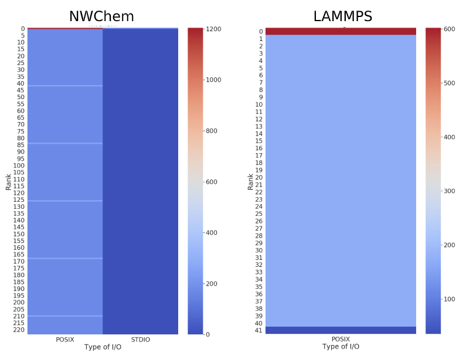
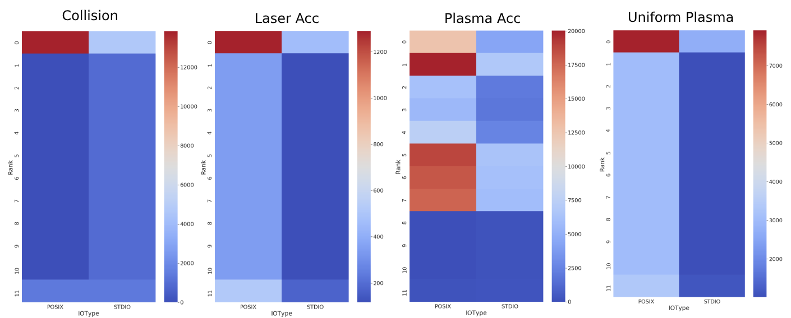

# Darshan DTX

Info for LAMMPS / NWChem / WarpX / XCG

## Brief Statistics

|  | LAMMPS  | NWChem | WarpX | XCG | GTC |
|---|---|---|---|---|---|
| Total ranks  | 224  | 224  | 12  | | |
| # ranks involved  | 42  | 224  |  12 | | |
| # files accesses |  8 | 468  |  Depending on test   (see bellow) | | |
| IO types | POSIX | POSIX / STDIO  | POSIX / STDIO  | | |
| FS type | NFS / GPFS / Unknown  | GPFS / Unknown  | GPFS / Unknown  | | |
| Access size (bytes) | POSIX: 17888 | POSIX: 37034   STDIO: 414 | Depending on test   (see bellow)  |  | |

## WarpX different tests

|  | Collision  | Laser Acc | Plasma Acc | Uniform Plasma |
|---|---|---|---|---|
| # files accesses |  530 | 62  |  1272 | 482  |
| Access size (bytes) | POSIX: 12491   STDIO: 27254 | POSIX: 6261   STDIO: 3607 | POSIX: 74286   STDIO: 58546 | POSIX: 35118  STDIO: 24874 |

## Amount of I/O per rank

WarpX

